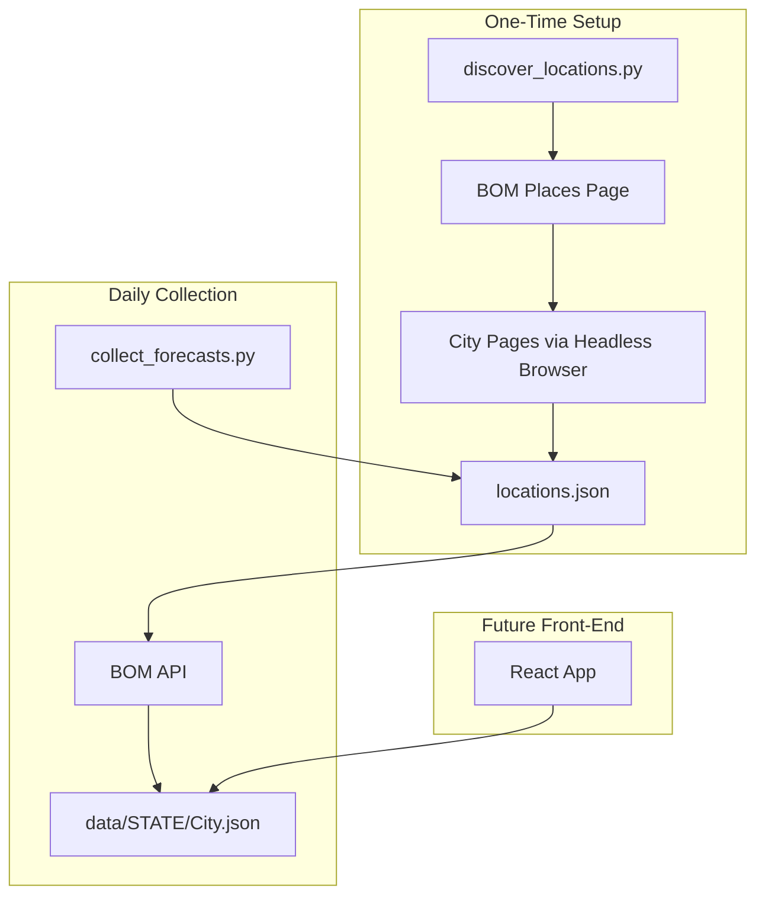

# Design Document: BOM Weather Tracker

## Overview

The BOM Weather Tracker system collects and stores daily weather predictions from the Australian Bureau of Meteorology API, enabling retrospective analysis of forecast accuracy. The system consists of two Python scripts:

1. **Location Discovery Script** (`discover_locations.py`): A one-time script that scrapes the BOM website to extract city locations and their corresponding API codes
2. **Daily Collection Script** (`collect_forecasts.py`): A cron-scheduled script that fetches 7-day forecasts for all configured locations and stores them in JSON files

Data is stored in a Git-friendly structure with one JSON file per city, organized by state, enabling version control and static hosting for a future React front-end.

## Architecture



### Data Flow

1. **Discovery Phase**: The discovery script navigates to BOM's places page, extracts city URLs, visits each city page with a headless browser to capture API calls, and outputs `locations.json`
2. **Collection Phase**: The daily script reads `locations.json`, calls the BOM API for each location, and updates the corresponding JSON file in `data/{state}/{city}.json`
3. **Retention**: Each update prunes forecast records older than 8 days

## Components and Interfaces

### Location Discovery Script (`discover_locations.py`)

**Purpose**: Extract city locations and API codes from BOM website

**Dependencies**:

- `playwright` or `selenium`: Headless browser automation
- `requests`: HTTP requests for initial page fetch
- `beautifulsoup4`: HTML parsing

**Functions**:

```python
def fetch_places_page() -> str:
    """Fetch the BOM places page HTML content."""

def parse_city_links(html: str) -> list[dict]:
    """Extract city URLs and names from places page HTML.
    Returns: [{"name": "Sydney", "url": "https://...", "state": "NSW"}, ...]
    """

def extract_api_code(city_url: str) -> str | None:
    """Use headless browser to load city page and capture API endpoint.
    Returns: Location code like "653/225" or None if not found.
    """

def state_name_to_abbrev(state_name: str) -> str:
    """Convert URL state name to abbreviation.
    Example: "new-south-wales" -> "NSW"
    """

def discover_all_locations() -> list[dict]:
    """Main orchestration function.
    Returns: [{"name": "Sydney", "state": "NSW", "url": "...", "api_code": "653/225"}, ...]
    """
```

**Output**: `locations.json`

```json
{
  "locations": [
    {
      "name": "Sydney",
      "state": "NSW",
      "url": "https://www.bom.gov.au/location/australia/new-south-wales/metropolitan/bnsw_pt131-sydney",
      "api_code": "653/225",
      "timezone": "Australia/Sydney"
    }
  ],
  "discovered_at": "2025-12-20T10:00:00Z"
}
```

### Daily Collection Script (`collect_forecasts.py`)

**Purpose**: Fetch daily forecasts and update JSON storage

**Dependencies**:

- `requests`: HTTP requests to BOM API
- `json`: JSON serialization/deserialization

**Functions**:

```python
def load_locations(path: str = "locations.json") -> list[dict]:
    """Load location configuration from JSON file."""

def fetch_forecast(api_code: str, timezone: str) -> dict | None:
    """Call BOM API and return raw forecast data.
    Implements retry logic for network failures.
    """

def parse_forecast(raw_data: dict) -> list[dict]:
    """Extract relevant fields from API response.
    Returns: [{"forecast_date": "2025-12-20", "temp_max": 34.1, ...}, ...]
    """

def load_existing_data(filepath: str) -> dict:
    """Load existing forecast data from JSON file, or return empty structure."""

def merge_forecasts(existing: dict, new_forecasts: list[dict], collection_date: str) -> dict:
    """Merge new forecasts into existing data structure."""

def prune_old_records(data: dict, cutoff_date: str) -> dict:
    """Remove forecast records older than cutoff date."""

def save_forecast_data(filepath: str, data: dict) -> None:
    """Write forecast data to JSON file with consistent formatting."""

def collect_all_forecasts() -> dict:
    """Main orchestration function.
    Returns: {"processed": 50, "success": 48, "failed": 2}
    """
```

### Shared Utilities (`utils.py`)

```python
def setup_logging() -> logging.Logger:
    """Configure logging with timestamp and context."""

def get_data_filepath(state: str, city: str) -> str:
    """Generate filepath for city data file."""

def retry_request(func, max_retries: int = 3, delay: float = 1.0):
    """Decorator/wrapper for retry logic on network requests."""
```

## Data Models

### Location Configuration (`locations.json`)

```python
@dataclass
class Location:
    name: str           # City name as displayed on BOM website
    state: str          # State abbreviation (NSW, VIC, etc.)
    url: str            # Full BOM city page URL
    api_code: str       # API location code (e.g., "653/225")
    timezone: str       # Timezone for API requests
```

### Forecast Data (`data/{state}/{city}.json`)

```python
@dataclass
class DailyPrediction:
    collection_date: str    # ISO date when forecast was collected
    temp_max_cel: float     # Maximum temperature in Celsius
    temp_min_cel: float     # Minimum temperature in Celsius
    precip_chance: int      # Probability of any precipitation (%)
    precip_10mm_chance: int # Probability of 10mm+ precipitation (%)
    weather_icon: int       # BOM weather icon code

@dataclass
class ForecastRecord:
    forecast_date: str                      # ISO date this forecast is for
    predictions: dict[str, DailyPrediction] # Keyed by collection_date
```

**JSON Structure**:

```json
{
  "location": {
    "name": "Sydney",
    "state": "NSW",
    "api_code": "653/225",
    "timezone": "Australia/Sydney"
  },
  "forecasts": {
    "2025-12-20": {
      "2025-12-13": {
        "temp_max_cel": 32.5,
        "temp_min_cel": 21.0,
        "precip_chance": 20,
        "precip_10mm_chance": 5,
        "weather_icon": 3
      },
      "2025-12-14": {
        "temp_max_cel": 33.0,
        "temp_min_cel": 21.5,
        "precip_chance": 15,
        "precip_10mm_chance": 3,
        "weather_icon": 1
      }
    },
    "2025-12-21": {
      "2025-12-14": {
        "temp_max_cel": 28.0,
        "temp_min_cel": 19.0,
        "precip_chance": 40,
        "precip_10mm_chance": 15,
        "weather_icon": 6
      }
    }
  },
  "last_updated": "2025-12-20T06:00:00Z"
}
```

This structure allows the front-end to:

- Look up a specific forecast date (e.g., "2025-12-20")
- See all predictions made for that date, keyed by when they were collected
- Display the "reverse forecast" showing how predictions evolved over time

## Correctness Properties

_A property is a characteristic or behavior that should hold true across all valid executions of a system-essentially, a formal statement about what the system should do. Properties serve as the bridge between human-readable specifications and machine-verifiable correctness guarantees._

Based on the acceptance criteria analysis, the following properties must hold:

### Property 1: Forecast Data Round-Trip Serialization

_For any_ valid forecast data structure, serializing to JSON and deserializing back SHALL produce an equivalent data structure with all fields intact.

**Validates: Requirements 3.5, 3.6**

### Property 2: API URL Location Code Extraction

_For any_ valid BOM API URL containing a location code pattern, the parsing function SHALL extract the correct location code (e.g., "653/225" from the URL path).

**Validates: Requirements 1.5**

### Property 3: State Name to Abbreviation Mapping

_For any_ valid Australian state name in URL format (e.g., "new-south-wales", "victoria"), the mapping function SHALL return the correct standard abbreviation (NSW, VIC, QLD, SA, WA, TAS, NT, ACT).

**Validates: Requirements 1.6, 4.3**

### Property 4: API Response Field Extraction

_For any_ valid BOM API response containing daily forecast data, the parsing function SHALL extract temperature maximums, temperature minimums, precipitation probabilities, and weather icon codes for each forecast day.

**Validates: Requirements 2.3**

### Property 5: Merge Preserves Existing Data

_For any_ existing forecast data and new forecast data, merging SHALL preserve all existing predictions while adding new predictions, with no data loss.

**Validates: Requirements 3.3**

### Property 6: Pruning Removes Only Old Records

_For any_ forecast data structure and cutoff date, pruning SHALL remove all records with forecast dates older than the cutoff while preserving all records at or after the cutoff.

**Validates: Requirements 3.4**

### Property 7: Collection Date Chronological Ordering

_For any_ forecast data structure after an append operation, the collection dates within each forecast date group SHALL be in chronological order.

**Validates: Requirements 5.2**

### Property 8: Partial Failure Resilience

_For any_ list of locations where some operations fail, the system SHALL successfully process all non-failing locations and return results for each.

**Validates: Requirements 1.4, 2.4**

### Property 9: Retry Mechanism Attempts

_For any_ network request that fails, the retry mechanism SHALL attempt the request up to the configured maximum number of retries before reporting failure.

**Validates: Requirements 6.4**

### Property 10: Data File Path Generation

_For any_ valid location with state abbreviation and city name, the path generation function SHALL produce a path matching the pattern `data/{state}/{city}.json`.

**Validates: Requirements 4.1**

## Error Handling

### Network Errors

- **Timeout**: Retry up to 3 times with exponential backoff (1s, 2s, 4s)
- **Connection Error**: Log error with URL and continue to next location
- **HTTP 4xx/5xx**: Log status code and response, continue to next location

### File System Errors

- **File Not Found** (on read): Return empty data structure, create new file on write
- **Permission Denied**: Log error and exit with non-zero status
- **Disk Full**: Log error and exit with non-zero status

### Data Validation Errors

- **Invalid JSON**: Log parsing error with file path, skip location
- **Missing Required Fields**: Log warning, use default values where safe
- **Invalid Date Format**: Log error, skip the malformed record

### Logging Format

```
[2025-12-20T06:00:00Z] [INFO] Starting forecast collection for 50 locations
[2025-12-20T06:00:01Z] [INFO] Processing Sydney (NSW) - 653/225
[2025-12-20T06:00:02Z] [ERROR] API timeout for Melbourne (VIC) - 653/226 (attempt 1/3)
[2025-12-20T06:00:05Z] [INFO] Completed: 48 success, 2 failed
```

## Testing Strategy

### Property-Based Testing

The system will use **Hypothesis** as the property-based testing library for Python. Each correctness property will be implemented as a Hypothesis test with a minimum of 100 iterations.

Property tests will be tagged with comments referencing the design document:

```python
# **Feature: bom-weather-tracker, Property 1: Forecast Data Round-Trip Serialization**
@given(forecast_data=forecast_data_strategy())
def test_forecast_round_trip(forecast_data):
    ...
```

**Generators Required**:

- `forecast_data_strategy()`: Generates valid ForecastRecord structures
- `location_strategy()`: Generates valid Location structures
- `api_url_strategy()`: Generates valid BOM API URLs with location codes
- `state_name_strategy()`: Generates valid Australian state names in URL format
- `api_response_strategy()`: Generates valid BOM API response structures

### Unit Tests

Unit tests will cover:

- Edge cases for date handling (timezone boundaries, leap years)
- Empty data structures
- Single-item collections
- Boundary conditions for the 8-day retention window

### Integration Tests

Manual integration tests will verify:

- End-to-end discovery script execution against BOM website
- End-to-end collection script execution against BOM API
- File system operations (create, read, update)

### Test File Organization

```
tests/
├── test_discovery.py      # Tests for discover_locations.py
├── test_collection.py     # Tests for collect_forecasts.py
├── test_serialization.py  # Round-trip and serialization tests
├── test_utils.py          # Tests for shared utilities
└── conftest.py            # Shared fixtures and strategies
```
