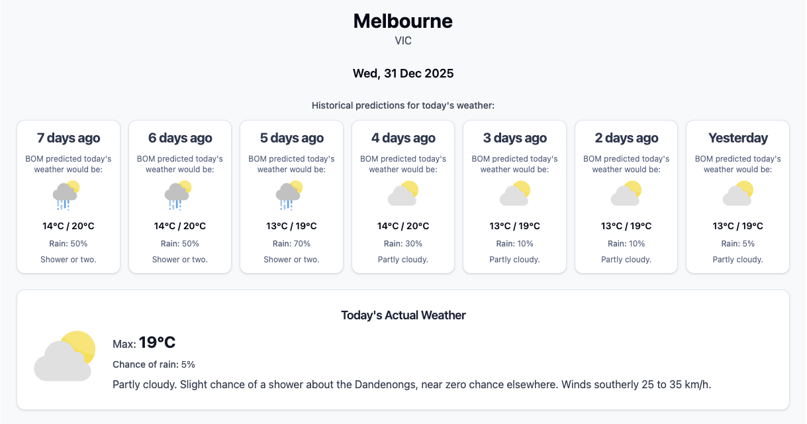

# BOM Weather Reporter

A full-stack application that tracks weather forecast accuracy from the Australian Bureau of Meteorology (BOM). It collects daily forecasts and lets you compare what was predicted vs what actually happened.

## Overview

Traditional weather forecasts predict 7 days ahead, but we rarely remember what was predicted when the day arrives. This app solves that by:

1. **Collecting** daily forecasts from BOM's FTP server for ~100 Australian cities
2. **Storing** predictions indexed by "days ahead" (7 days ago prediction → today's actual)
3. **Visualizing** how predictions evolved over time via an interactive dashboard

Below is a representative example. On Xmas day 2025, the BOM were predicting that NYE would be rainy in Melbourne, so people might reasonably have avoided holding that garden party, especially given the continued predictions for rain over the next few days. In actuality, the weather on NYE turned out fine:



This tool isn't meant to criticise the BOM's weather forecasts — it's about understanding forecast reliability. By comparing predictions made at different time horizons, you can see how accuracy changes as forecasts get closer to the actual date

## Project Structure

```
├── collect_forecasts.py    # CLI entry point for data collection
├── src/                    # Python backend package
│   ├── collector.py        # Orchestration logic
│   ├── config.py           # Configuration loading
│   ├── file_io.py          # JSON file read/write
│   ├── ftp_fetcher.py      # BOM FTP download with retry
│   ├── merger.py           # Forecast merging and retention
│   ├── models.py           # Data classes (LocationData, ForecastRecord, PredictionEntry)
│   └── xml_parser.py       # BOM XML parsing
├── dashboard/              # React frontend
│   └── src/
│       ├── components/     # UI components (MapComponent, WeatherIcon, etc.)
│       ├── pages/          # HomePage, CityPage, NotFoundPage
│       ├── context/        # CitiesProvider for global state
│       ├── hooks/          # Custom hooks (useForecast, useCityWeatherIcons)
│       └── types/          # TypeScript definitions
├── data/                   # Forecast data (Git-tracked)
│   ├── locations.json      # Location configuration
│   ├── cities.geojson      # City coordinates for map
│   └── {STATE}/{City}.json # Per-city forecast files
└── tests/                  # Python test suite
```

## Backend (Python)

### Requirements

- Python 3.10+
- Dependencies: `requests`, `playwright`, `beautifulsoup4`, `geopy`

### Installation

```bash
pip install -r requirements.txt
# Or for development
pip install -e ".[dev]"
```

### Usage

```bash
# Collect forecasts for all cities
python collect_forecasts.py

# Single city
python collect_forecasts.py --city Sydney

# Verbose logging
python collect_forecasts.py -v
```

### Data Flow

1. Load location config from `data/locations.json`
2. Fetch XML from `ftp://ftp.bom.gov.au/anon/gen/fwo/{product_id}.xml`
3. Parse forecast periods (temps, precipitation, conditions)
4. Merge with existing data, preserving historical predictions
5. Apply 8-day retention policy
6. Write to `data/{state}/{city}.json`

## Frontend (React + TypeScript)

### Tech Stack

- React 19 + TypeScript
- Vite for bundling
- Tailwind CSS for styling
- Leaflet + react-leaflet for maps
- React Router for navigation

### Installation

```bash
cd dashboard
npm install
```

### Development

```bash
npm run dev      # Start dev server
npm run build    # Production build
npm run test     # Run tests
npm run lint     # ESLint
```

### Key Components

| Component         | Purpose                                                              |
| ----------------- | -------------------------------------------------------------------- |
| `HomePage`        | Landing page with Australia map, capital city forecasts, city search |
| `CityPage`        | Individual city view with forecast history and mini-map              |
| `MapComponent`    | Interactive Leaflet map with weather icon markers                    |
| `ReverseForecast` | Shows how predictions for today evolved over the past 7 days         |
| `WeatherIcon`     | Renders BOM weather icons based on icon codes                        |

### Routes

- `/` — Home page with interactive map
- `/city/:state/:cityName` — City forecast page (e.g., `/city/NSW/Sydney`)

## Data Format

Each city's JSON file contains:

```json
{
  "product_id": "IDN10064",
  "city_name": "Sydney",
  "state": "NSW",
  "timezone": "EST",
  "forecasts": {
    "2025-12-28": {
      "0": { "icon_code": 3, "temp_max": 28, "precis": "Sunny" },
      "1": { "icon_code": 3, "temp_max": 27, "precis": "Mostly sunny" },
      ...
    }
  }
}
```

The `forecasts` object is keyed by date, with each date containing predictions indexed by "days ahead" (0 = actual, 1 = predicted yesterday, etc.).

## Running Tests

```bash
# Python tests
pytest

# Frontend tests
cd dashboard && npm test
```

## License

MIT
